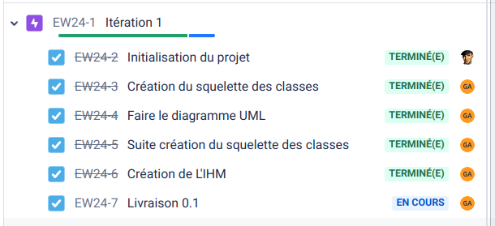

 

 

# Le projet ergonomic-workstation 2024

- [Le projet ergonomic-workstation 2024](#le-projet-ergonomic-workstation-2024)
  - [Présentation](#présentation)
  - [Fonctionnalités](#fonctionnalités)
  - [Documentation du code](#documentation-du-code)
  - [Diagramme de classes](#diagramme-de-classes)
  - [Protocole](#protocole)
  - [Screenshots](#screenshots)
  - [Historique des versions](#historique-des-versions)
  - [Auteurs](#auteurs)

---

## Présentation

Il s'agit de digitaliser un poste de travail afin de guider l’opérateur pas à pas dans la réalisation d’un processus d’assemblage.

## Fonctionnalités

La table ergonomique devra être capable de proposer plusieurs processus d'assemblage et d'accompagner l'opérateur durant le  processus d'assemblage.

|Tâche|Priorité|Itération|
|-----|:------:|:-------:|
|Séquences les opérations|H|2|
|Visualiser les statistique de production|B|3|
|Visualiser tous les processus d’assemblage|H|1|
|Arrêter le système à tout moment|M|3|
|Choisir un opérateur|B|3|
|Détecter une erreur|M|2|
|Choisir le processus d’assemblage|M|2|
|Communiquer avec le poste de travail (liaison série)|M|2|

## Documentation du code

https://btssn-lasalle-84.github.io/ergonomic-workstation-2024/

## Diagramme de classes

## Protocole

## Screenshots

## Historique des versions

- Version 0.1

## Auteurs

- Étudiant IR : AVRIL Gabain <<gabain.avril@gmail.com>>

---
©️ LaSalle Avignon 2024
