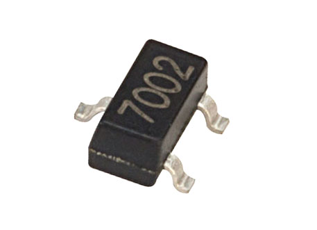

Composants : **Q1, Q2 et Q3**

Composant très sensible aux chocs thermiques et aux décharge électriques ESD (*electrostatic discharge*)

Porter un bracelet de mise à la terre lors de la dépose du composant sur son emplacement
