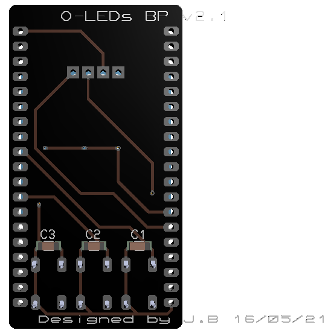

# Module O-LEDs-BP

Le module **O-LEDs-BP** est composé de 3 Boutons Poussoirs, de 3 Leds de couleur et d'un afficheur OLED.

L’assemblage de composants doit se réaliser toujours du plus petit composant vers le plus grand (sauf contrainte d’accessibilité ou de refusion).

Les composants CMS seront assemblés au four à refusion.

*Remarques :*

- Il est destiné à être exploité avec la carte **ESP’INFINITY**.
- La carte **ESP’INFINITY** est composée d’une station d’accueil de trois emplacements (*slots*).
